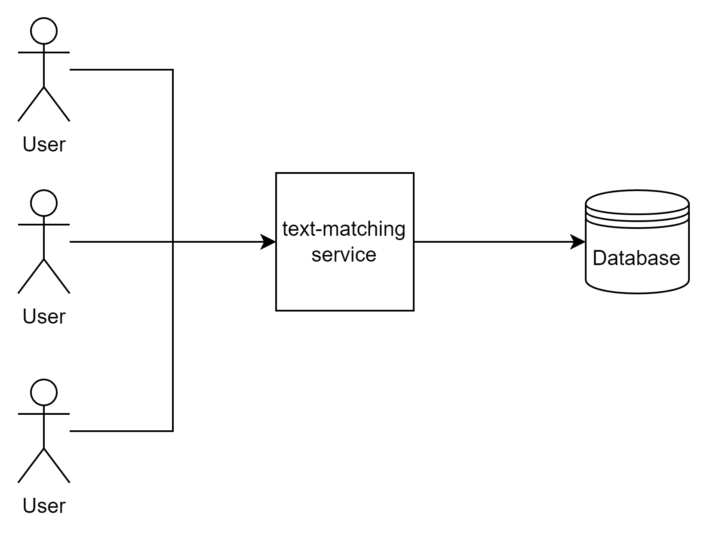
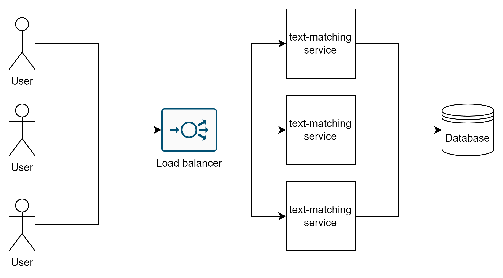
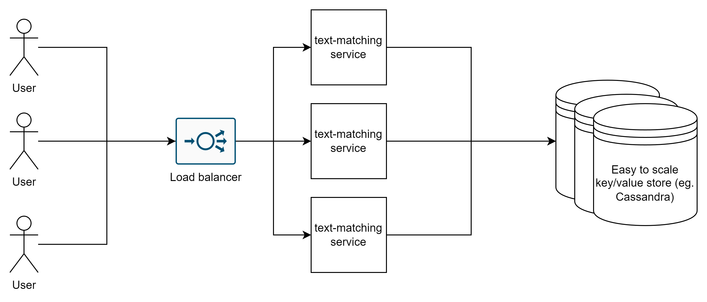
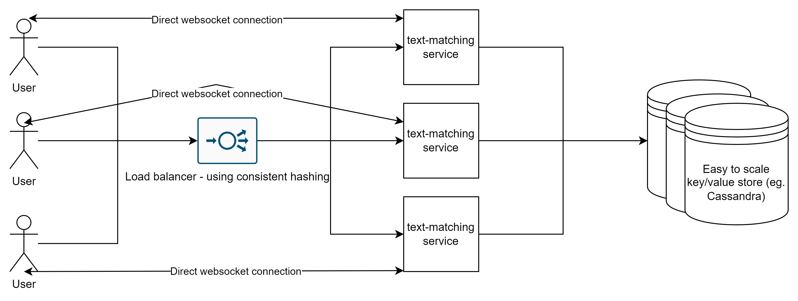
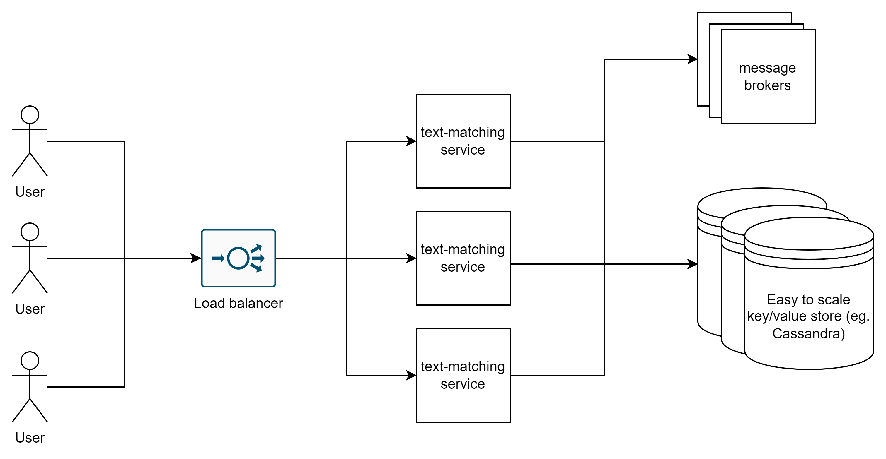
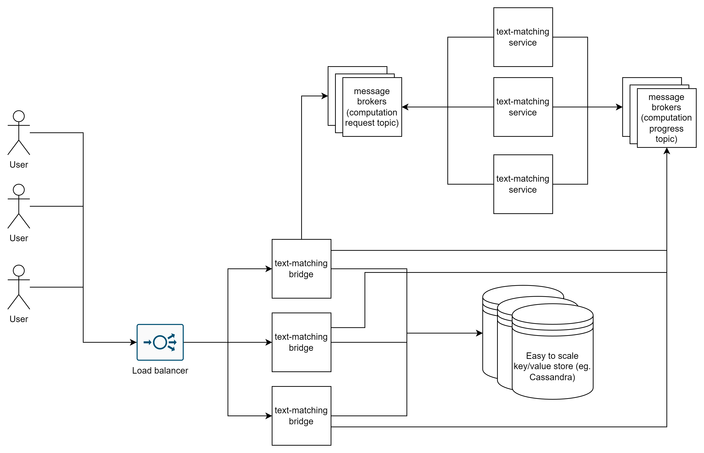
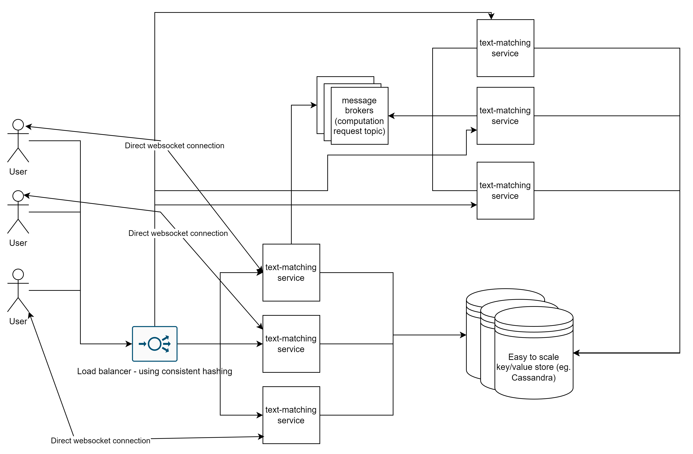

# Possible architectures

In this section I introduced possible architectures that I think could be implemented in real world depending on actual load and
business requirements. I ordered them from the simplest and requiring the least resources to the ones allowing the best
availability and horizontal scalability/with the highest throughput. I assumed that we require a persistent storage from the beginning.

1. Simple initial
    
   This is the most basic architecture with persistent storage. It does not allow horizontal scaling and when either
   service or database goes down for some reason the system will be unavailable
2. With service scaling
    
   This solution has an advantage regarding system availability and throughput. If one instance of text-matching service goes down
   the system should be still available (assuming rest of the instances can handle the load)
3. With database scaling
    
   We have made our storage scalable and available by choosing Cassandra. Having current requirements I think easy to scale key/value store is a good choice. If
   we need more throughput or higher availability all we need it is to add more nodes to the cluster and potentially reconfigure it. Cassandra is by default
   AP (Available Partition-tolerant) and can be reconfigured for CP according to documentation. If the text-matching service would have to be enriched in the
   future by adding new requirements then I would reconsider this choice and choose the best solution.
    1. Using web sockets
        
       Adding websockets will make our text-matching service more efficient (less network traffic and CPU consumption) and make the service more
       responsive at the cost of additional RAM consumed by file descriptors. From now on we require load balancer(s) to use consistent hashing to
       minimize number of active connections when number of available text-matching-service instances change.
    2. Using message brokers
        
       Instead of adding web sockets to architecture described in point 3. we could use message brokers. We rather don't task right away, but we
       can send messages to message broker. Our text-matching service will subscribe to message broker and execute tasks upon receiving the messages.
       This improves availability in case of sudden traffic load increase and decreases chance of unsuccessful requests happening. Message brokers
       often implement mechanisms that allows us to limit traffic more reliably and issue retries in case of unsuccessful processing. The disadvantage of this
       solution is increased processing time (looking from user's point of view) compared to both 3. and 3.i architectures.
    3. Using message brokers with two microservices
        
       Additionally to point 3.ii we could also separate the service into two microservices. Text-matching bridge would receive users' requests and then send
       messages to computation request topic. Text-matching service would subscribe to the topic mentioned and emit messages to computation progress topic.
       Text-matching bridge would then receive messages and persist the results. This would allow to scale both services independently and in case every
       instance of
       one microservice does not work the other would be still available and therefore part of the system would still work.
4. Combined approach
    
   By combining techniques described in point 3.i and 3.iii with some modifications we end up with architecture shown above. Here we process tasks right away and
   use web sockets as our main method of communication but when the service load is high, and we shouldn't accept any more computation requests we use
   processing based on message brokers as a backup plan. A separate set of service instances is responsible for processing asynchronous messages and retrieving
   results persisted in database. Note that the service is not separated into two microservices because we will have to keep computation logic in every instance
   of the service. In this approach not only we achieved more efficiency and responsiveness by default, but also availability in case currently allocated
   resources are not enough to handle the traffic right away

## Additional notes regarding architectures:

- We should also replicate the load balancer to eliminate single point of failure.
  Implementing load balancing using sidecar proxy approach would additionally allow end-to-end observability at service instance level
- To ensure the best availability components should be deployed in multiple geographical locations.
- Having a sharded/partitioned/replicated SQL database is an option in case of more complex business requirements, but it typically requires more
  resources and more effort in order to implement and deploy.
- I did not consider cloud-based services in my work but that's also an option if we want to move part infrastructural responsibility to 3rd party.
- Consider caching data in microservices or in centralised cache like Redis in case of frequent repeated read of same data
- We don't have to use specified order in the list above (for e.g. we can add websockets without any scaling). We should consider business requirements when
  deciding which approach to use

## Chosen architecture

Because of limited requirements regarding throughput and availability I did not decide to implement a service compatible with most complex architecture. In this
project I chose architecture described in 3.ii. It's compatible with task description and in my opinion it's good enough to start with for most real-world use cases and since it does not include
websockets which could be sometimes incompatible with currently existing company's infrastructure, deployment should be easier.    

# Deploying
Deploying on production environment would require further configuration. 

Make sure you have enough RAM space available for docker containers. Run script `deployments/deploy-local-cluster.sh` in order to deploy:
- A nginx proxy/load balancer
- Two instances of text-matching service
- A cluster of cassandra (two nodes)
- A cluster of rabbitmq (two instances)

Application will be available under port 80.
