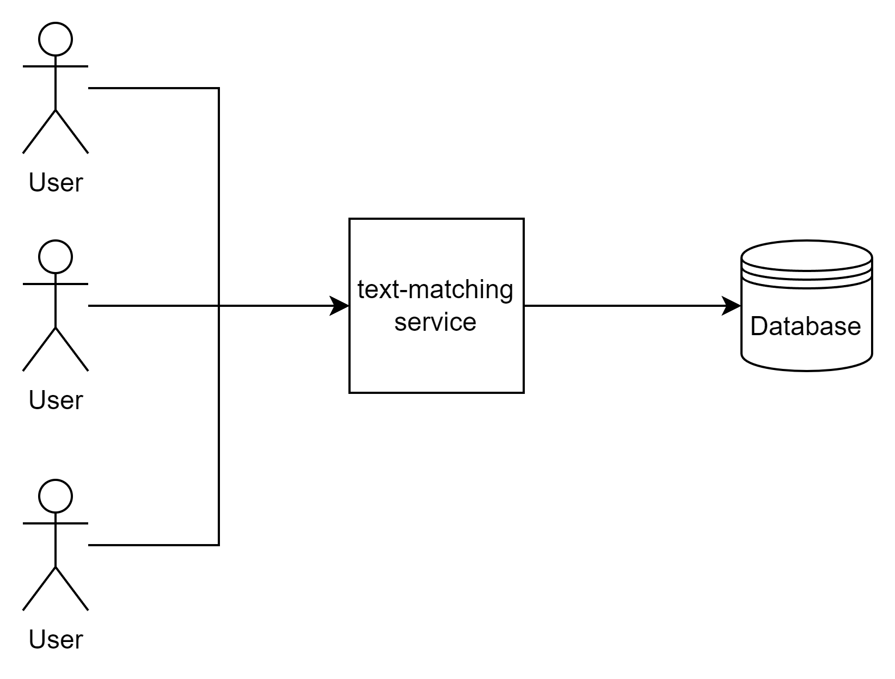
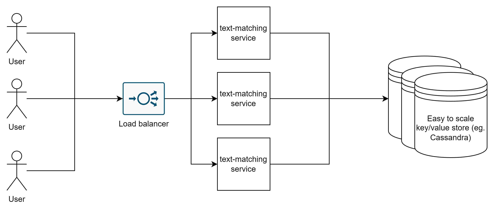

# Possible architectures

In this readme I introduced possible architectures that I think could be implemented in real world depending on actual load and
business requirements. I ordered them from the simplest and requiring the least resources to the ones allowing the best 
availability and horizontal scalability/with the highest throughput. I assumed that we require a persistent storage from the beginning.

## The actual list
1. Simple initial
   
  This is the most basic architecture with persistent storage. It does not allow horizontal scaling and when either 
  service or database goes down for some reason the system will be unavailable
2. With service scaling
  
  This solution has an advantage regarding system availability and throughput. If one instance of text-matching service goes down
  the system should be still available (assuming rest of the instances can handle the load)
3. With database scaling
  
  We have made our storage scalable and available by choosing Cassandra. Having current requirements I think easy
  to scale key/value store is a good choice. If we need more throughput or higher availability all we need it is adding more nodes 
  to the cluster and potentially reconfigure it. Cassandra is by default AP (Available Partition-tolerant) and can be reconfigured  
  for CP according to documentation. If the text-matching service would have to be enriched in the future by adding new requirements then I would
  reconsider this choice and choose the best solution.
4. With websockets
  
  Adding websockets will make our services a lot more efficient (less network traffic and CPU consumption) at the cost of additional
  RAM consumed by file descriptors. From now on we require load balancer(s) to use consistent hashing to minimize number of active
  connections when number of available text-matching-service instances change 

# Additional notes:
- We can also (and probably should) replicate the load balancer to eliminate single point of failure.
- To ensure the best availability components should be deployed in multiple geographical locations.
- Having a sharded/partitioned/replicated SQL database is also an option in case of more complex business requirements, but it requires more 
  resources and more effort in order to implement and deploy.
- I did not consider cloud-based services in my work but that's also an option.
- We could also separate the service into two microservices. The first one would be responsible for computing and communicating 
  over websockets and the second would allow to read the data about previous computations over standard http endpoints. This would
  allow to scale services independently and in case every instance of one microservice does not work the other would be still available
  and therefore part of the system would still work.
- Consider caching data in microservices or in centralised cache like Redis in case of frequent repeated read of same data 
- We don't have to use specified order in the list above (for e.g. we can add websockets without any scaling). We should consider the requirements first
